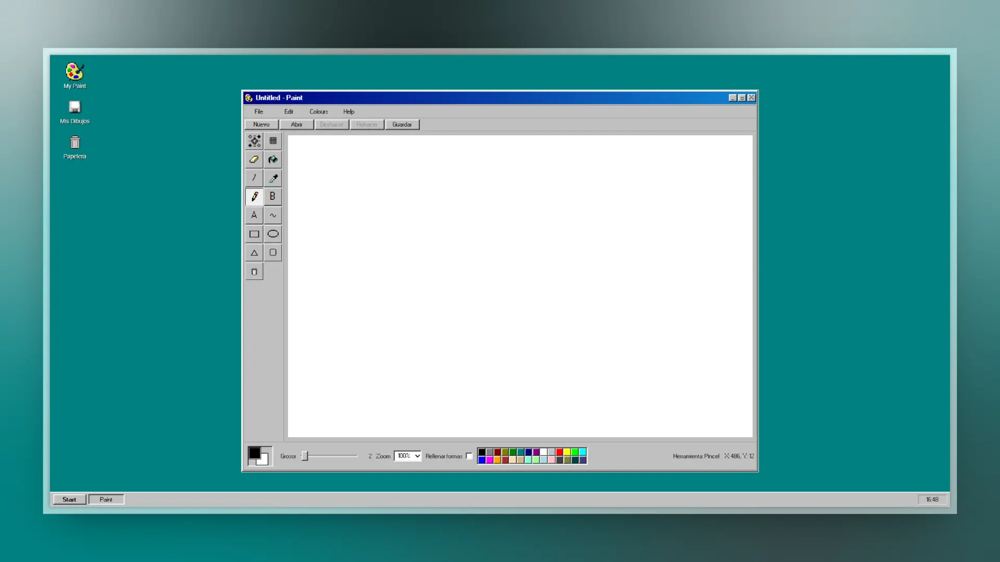

# Paint Win 95'

Aplicación de dibujo inspirada en Microsoft Paint de Windows 95.

## 🌐 Navegación rápida / Quick Navigation

- [🇪🇸 Versión en Español](#-español)
- [🇬🇧 English Version](#-english)

---

## 🇪🇸 Español

### 🎨 Descripción
Paint Win 95' recrea la experiencia clásica de Paint con estética retro y funcionalidades modernas para web.

### ✨ Características
- Herramientas: lápiz, brocha, borrador, línea, curva, rectángulo, rectángulo redondeado, elipse, polígono, relleno, texto y selecciones.
- Paleta de colores clásica estilo Win95 con color primario/secundario.
- Historial de deshacer/rehacer.
- Zoom de trabajo (`100%`, `200%`, `400%`).
- Apertura de imágenes locales y exportación a PNG.
- Soporte para mouse, teclado y entrada táctil/stylus (`Pointer Events`).
- Interfaz responsive adaptada a distintos tamaños de pantalla.

### 🚀 Uso
1. Abre la app en un navegador moderno.
2. Elige una herramienta en la barra lateral.
3. Dibuja en el lienzo.
4. Ajusta color, grosor y zoom.
5. Guarda el resultado con `Guardar`.

### ⌨️ Atajos
- `Ctrl/Cmd + Z`: deshacer
- `Ctrl/Cmd + Y` o `Ctrl/Cmd + Shift + Z`: rehacer
- `Ctrl/Cmd + S`: guardar PNG
- `Ctrl/Cmd + O`: abrir imagen local
- `B`: brocha
- `E`: borrador
- `L`: línea
- `R`: rectángulo
- `C`: elipse
- `F`: relleno
- `T`: texto
- `S`: selección rectangular
- `X`: intercambiar color primario/secundario

### 🛠️ Scripts
- `npm run dev`: servidor de desarrollo
- `npm run build`: build de producción
- `npm run preview`: previsualización local del build
- `npm run verify`: validación rápida (build)

### 🤝 Contribuciones
¿Quieres mejorar el proyecto? Los PRs son bienvenidos.

1. Haz un fork.
2. Crea una rama (`feature/tu-mejora`).
3. Envía tu PR con una descripción clara de cambios.

### 📌 Problemas conocidos
- El `EyeDropper` de sistema depende del soporte del navegador.

### 📄 Licencia
Distribuido bajo licencia MIT. Consulta [LICENSE](LICENSE).

### 🔗 Demo
https://paint-win-95-blond.vercel.app/

---

## 🇬🇧 English

### 🎨 Description
Paint Win 95' recreates the classic Microsoft Paint experience with a retro UI and modern web behavior.

### ✨ Features
- Tools: pencil, brush, eraser, line, curve, rectangle, rounded rectangle, ellipse, polygon, fill, text, and selection tools.
- Classic Win95-like color palette with primary/secondary colors.
- Undo/redo history.
- Working zoom levels (`100%`, `200%`, `400%`).
- Open local images and export to PNG.
- Mouse, keyboard, and touch/stylus support (`Pointer Events`).
- Responsive layout for multiple screen sizes.

### 🚀 Usage
1. Open the app in a modern browser.
2. Select a tool from the left toolbar.
3. Draw on the canvas.
4. Adjust color, stroke width, and zoom.
5. Save your drawing with `Guardar`.

### ⌨️ Shortcuts
- `Ctrl/Cmd + Z`: undo
- `Ctrl/Cmd + Y` or `Ctrl/Cmd + Shift + Z`: redo
- `Ctrl/Cmd + S`: save PNG
- `Ctrl/Cmd + O`: open local image
- `B`: brush
- `E`: eraser
- `L`: line
- `R`: rectangle
- `C`: ellipse
- `F`: fill
- `T`: text
- `S`: rectangular selection
- `X`: swap primary/secondary color

### 🛠️ Scripts
- `npm run dev`: development server
- `npm run build`: production build
- `npm run preview`: preview production build locally
- `npm run verify`: quick verification (build)

### 🤝 Contributing
PRs are welcome and encouraged.

1. Fork the repository.
2. Create a branch (`feature/your-improvement`).
3. Open a Pull Request with a clear change summary.

### 📌 Known issues
- System-level `EyeDropper` depends on browser support.

### 📄 License
Released under MIT. See [LICENSE](LICENSE).

### 🔗 Live demo
https://paint-win-95-blond.vercel.app/

---

### 👨‍💻 Portfolio
Fr4n0m - https://codebyfran.es
